# 在Dragonboard 410c上安装Ubuntu Core

## 材料清单
我们将要下载Ubuntu Core的镜像文件，烧写到SD卡上，然后放到Dragonboard上启动并进行初始化设置。除Dragonboard外，还需要准备以下物品：
* 电脑（用于烧写SD卡，Windows/Linux/Mac都可以，本文以Macbook为例）
* Micro SD卡和读卡器（MicroSD卡没有特殊要求，我们使用的是SanDisk 4GB，Class4型号的）
    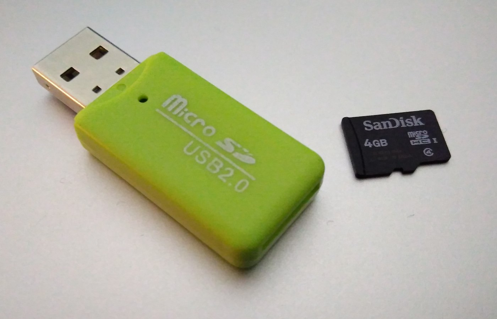
* USB接口的键盘
* HDMI视频线及显示器
* 可访问Internet的WiFi连接

## 注册Ubuntu One账号
最新的Ubuntu Core操作系统默认已不再提供本地登录账号，需要到[Ubuntu网站](https://login.ubuntu.com/)上注册一个Ubuntu One账号（访问各种Ubuntu服务的统一账号）并[上传公钥文件](https://login.ubuntu.com/ssh-keys)。待系统安装好以后，使用私钥文件以SSH方式登录。公钥和私钥对可以在电脑上用ssh-keygen命令生成。
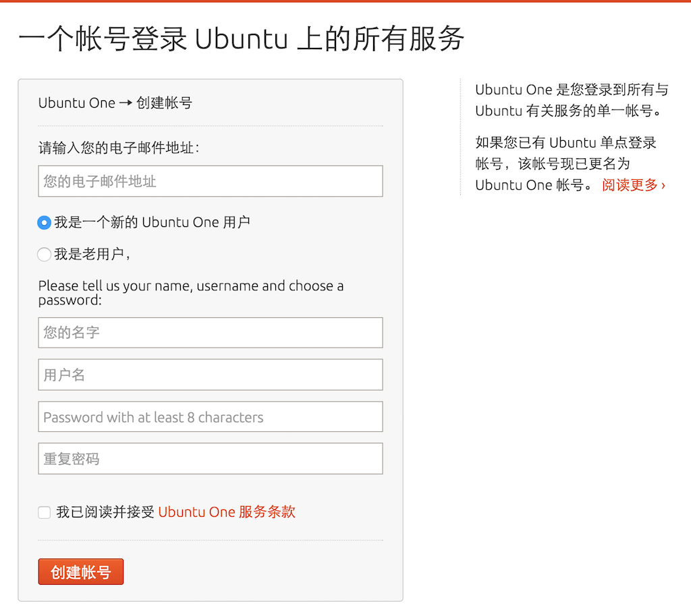

## 下载镜像文件
到这里下载最新的Ubuntu Core 16镜像：
[http://releases.ubuntu.com/ubuntu-core/16/](http://releases.ubuntu.com/ubuntu-core/16/)  
其中包含了适用于Raspberry Pi等多种硬件的文件，我们选择[ubuntu-core-16-dragonboard-410c.img.xz](http://releases.ubuntu.com/ubuntu-core/16/ubuntu-core-16-dragonboard-410c.img.xz)。  
下载完成以后检查一下文件的MD5：
```
$ md5 ~/Downloads/ubuntu-core-16-dragonboard-410c.img.xz 
MD5 (/Users/Tom/Downloads/ubuntu-core-16-dragonboard-410c.img.xz) = 2aa8f5b404826818e2de63e947b0bae7
```
将以上的值与文件[http://releases.ubuntu.com/ubuntu-core/16/MD5SUMS](http://releases.ubuntu.com/ubuntu-core/16/MD5SUMS)中的值对比一下，确认一致，以免网络问题导致下载的文件损坏。

## 烧写SD卡
1. 将Micro SD卡放进读卡器，插到电脑USB口上，然后使用diskUtil命令查看读卡器对应的设备，此处是/dev/disk2：
    ```
    $ diskutil list
    /dev/disk0 (internal, physical):
       #: TYPE NAME SIZE IDENTIFIER
       0: GUID_partition_scheme *251.0 GB disk0
       1: EFI EFI 209.7 MB disk0s1
       2: Apple_CoreStorage Macintosh HD 250.1 GB disk0s2
       3: Apple_Boot Recovery HD 650.0 MB disk0s3

    /dev/disk1 (internal, virtual):
       #: TYPE NAME SIZE IDENTIFIER
       0: Macintosh HD +249.8 GB disk1
                                     Logical Volume on disk0s2
                                     36C243A9-C568-4875-B987-5026D4C20FE7
                                     Unencrypted

    /dev/disk2 (external, physical):
       #: TYPE NAME SIZE IDENTIFIER
       0: FDisk_partition_scheme *4.0 GB disk2
       1: DOS_FAT_32 NO NAME 4.0 GB disk2s1
    ```
1. 卸载磁盘
    ```
    $ diskutil unmountDisk /dev/disk2
    Unmount of all volumes on disk2 was successful
    ```
1. 烧写镜像
    ```
    $ xzcat ~/Downloads/ubuntu-core-16-dragonboard-410c.img.xz | sudo dd of=/dev/disk2 bs=32m
    0+10366 records in
    0+10366 records out
    679297024 bytes transferred in 153.468353 secs (4426300 bytes/sec)
    ```
    * 注意32后面的单位是小写的m
    * 烧录过程中命令行会卡住几分钟，不显示进度信息  
    
    完成后再查看一下磁盘列表：
    ```
    $ diskutil list
    /dev/disk0 (internal, physical):
       #: TYPE NAME SIZE IDENTIFIER
       0: GUID_partition_scheme *251.0 GB disk0
       1: EFI EFI 209.7 MB disk0s1
       2: Apple_CoreStorage Macintosh HD 250.1 GB disk0s2
       3: Apple_Boot Recovery HD 650.0 MB disk0s3

    /dev/disk1 (internal, virtual):
       #: TYPE NAME SIZE IDENTIFIER
       0: Macintosh HD +249.8 GB disk1
                                     Logical Volume on disk0s2
                                     36C243A9-C568-4875-B987-5026D4C20FE7
                                     Unencrypted

    /dev/disk2 (external, physical):
       #: TYPE NAME SIZE IDENTIFIER
       0: GUID_partition_scheme *4.0 GB disk2
       1: DEA0BA2C-CBDD-4805-B4F9-F428251C3E98 1.0 MB disk2s1
       2: 098DF793-D712-413D-9D4E-89D711772228 1.0 MB disk2s2
       3: A053AA7F-40B8-4B1C-BA08-2F68AC71A4F4 1.0 MB disk2s3
       4: E1A6A689-0C8D-4CC6-B4E8-55A4320FBD8A 1.0 MB disk2s4
       5: 303E6AC3-AF15-4C54-9E9B-D9A8FBECF401 1.0 MB disk2s5
       6: 400FFDCD-22E0-47E7-9A23-F16ED9382388 2.1 MB disk2s6
       7: 20117F86-E985-4357-B9EE-374BC1D8487D 1.0 MB disk2s7
       8: Microsoft Basic Data system-boot 134.2 MB disk2s8
       9: Linux Filesystem 535.6 MB disk2s9
    ```
1. 最后，再次将磁盘从电脑上卸载，取下读卡器，拿出SD卡。

## 启动和初始化
1. 将烧写好的SD卡装入Drgonboard 410c的卡槽，将板背面的拨码开关S6拨到0110（第2、3位为ON，其他位OFF），连接键盘、显示器，然后接通电源。
    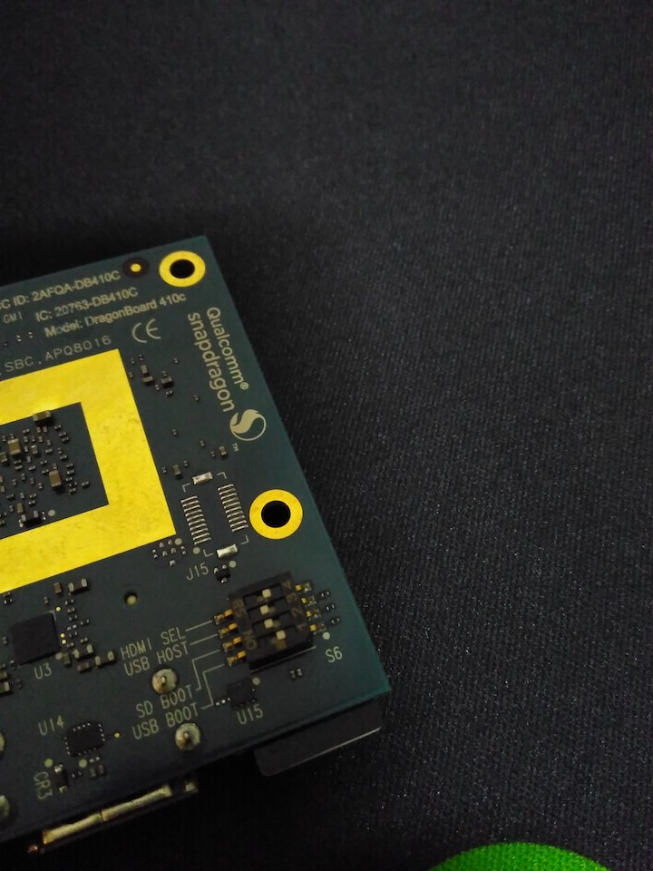  
    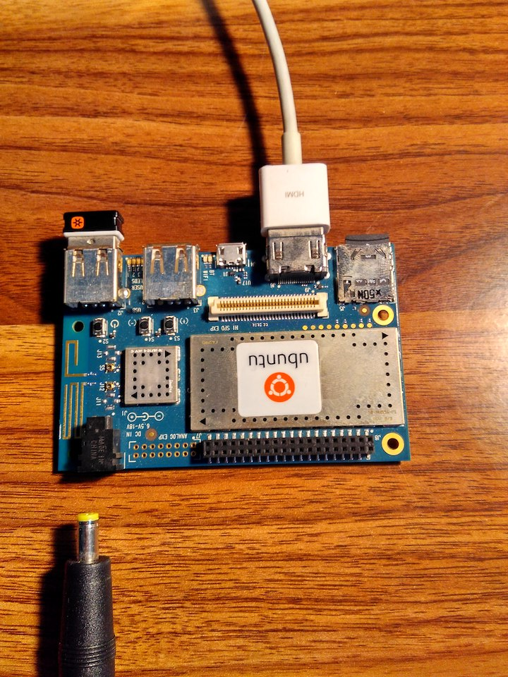  
    （笔者使用的是无线键盘，图中Drgonboard左上角USB接口连接的是键盘的无线适配器。）
1. 按照提示输入WiFi的SSID和密码，以连接网络。
    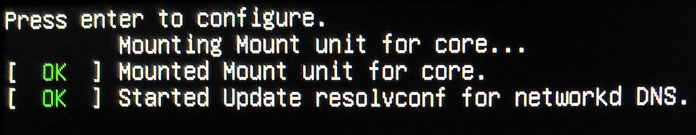  
    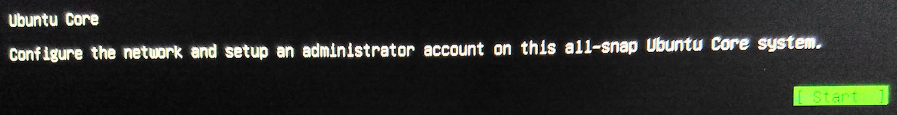  
    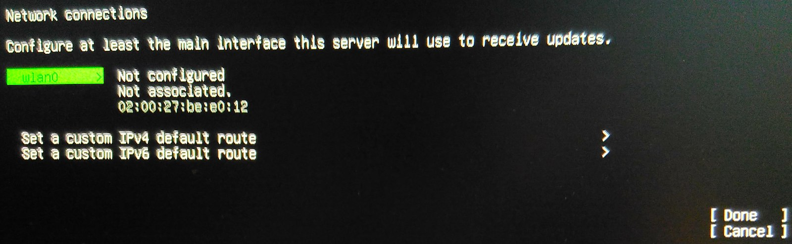  
    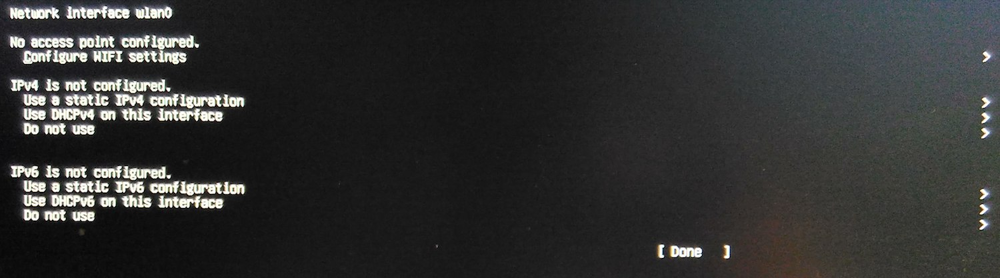  
    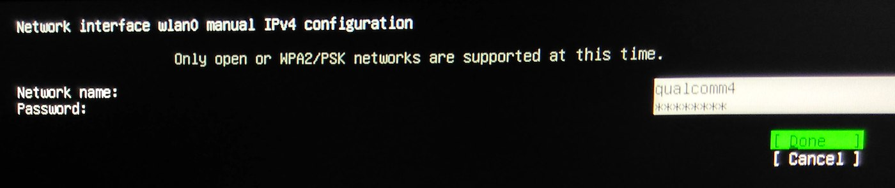  
    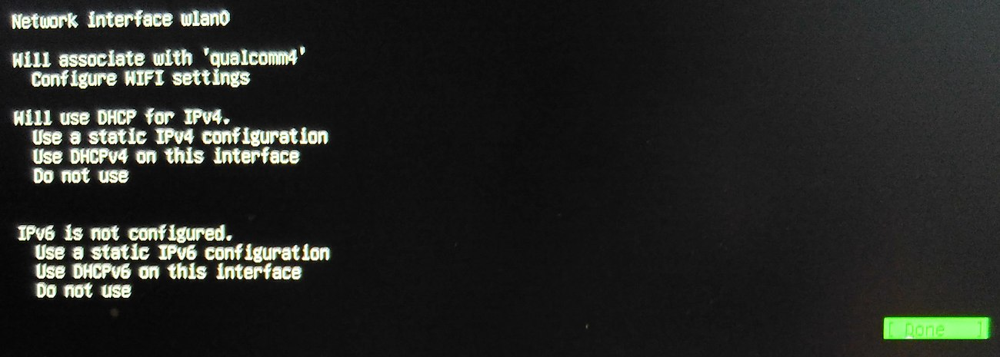  
    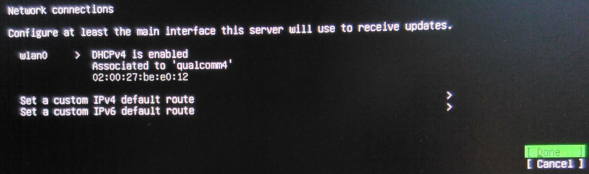  
1. 输入注册Ubuntu One账号的Email地址，完成初始化，记录下屏幕上显示的IP地址。
    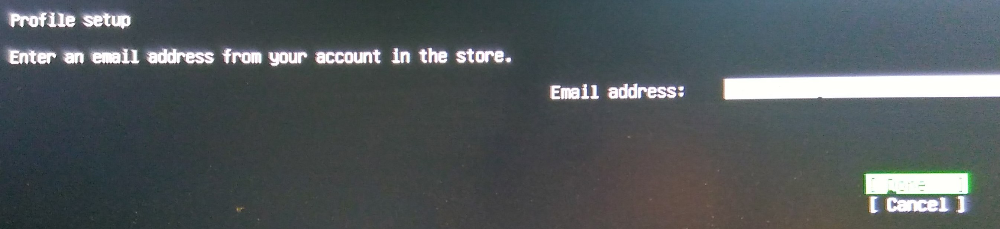  
    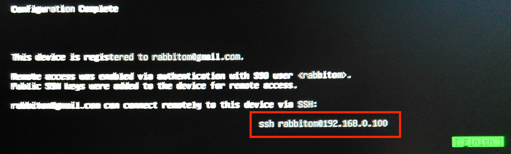  
      

## SSH登录
在电脑上确认能够ping通Dragonboard的IP地址，然后使用SSH命令登录，用-i参数指定私钥文件。
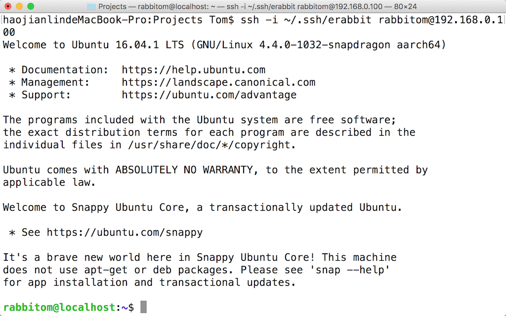