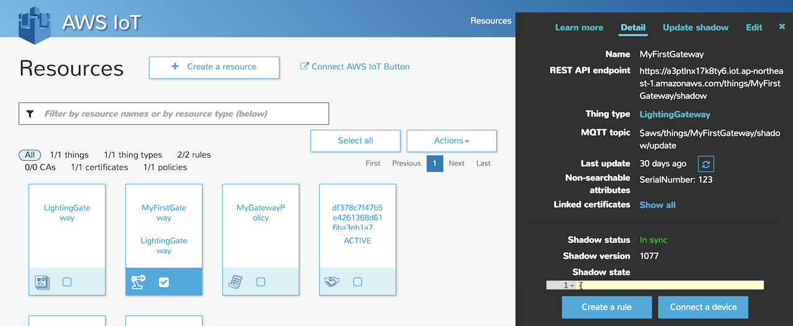

# 连接AWS IoT服务
## 管理控制台
要使用AWS的IoT服务连接和管理设备，需要先登录AWS管理控制台，创建设备对象、生成证书和设置访问策略。其中证书需要下载到本地，放到设备中，连接时需要。

## 设备连接
AWS IoT服务使用MQTT协议连接设备与云端，MQTT基于发布/订阅模型，是目前IoT领域设备与云端通信的主流消息协议。  
AWS已经将MQTT客户端封装进了设备SDK当中，在设备侧引入aws-iot-device-sdk，配置好证书、设备ID及IoT服务所在的区域即可实现连接。  
sdk提供了多种开发语言的版本，我们使用的是JavaScript：
```
var awsIot = require('aws-iot-device-sdk');

var thingShadows = awsIot.thingShadow({
   keyPath: path + '/certs/private.pem.key',
  certPath: path + '/certs/certificate.pem.crt',
    caPath: path + '/certs/root-CA.crt',
  clientId: gateway.id,
    region: 'ap-northeast-1',
});

var thingShadowConnected = false;
var clientTokenUpdate;

thingShadows.on('connect', function() {
	thingShadows.register(gateway.id);
	thingShadowConnected = true;
	setTimeout(gateway.reportState, 5000);
});
```
## 设备影子  
AWS IoT在MQTT的基础上定义了“设备影子”服务，用于管理设备状态。“设备影子”的内容实际上就是一个JSON文档，其具体字段由开发者自己定义，系统跟踪字段值的变化。在本应用中，灯的开关状态就是通过设备影子管理的，主要流程如下：  
1. 当网关检测到灯状态变化后，即发布report消息；
1. 云端收到report消息，即更新设备影子中灯的当前状态；
1. 用户通过Web页面设置灯的状态，发布desired消息；
1. 云端收到desired消息，通过对比其与当前状态的差别，发布delta消息；
1. 网关收到delta消息，根据消息内容设置灯的状态。
```
...
	reportState: function() {
		var curState = new Object();
		for(var light of gateway.lights) {
			curState[light.id] = {
				power: light.power
			};
		}
		var state = {
			"state": {
				"reported": curState
			}
		};
		clientTokenUpdate = thingShadows.update(gateway.id, state);
		if (clientTokenUpdate)
			console.log('updated shadow: ' + JSON.stringify(state));
		else
			console.log('update shadow failed, operation still in progress');
	}
...

thingShadows.on('delta', function(thingName, stateObject) {
	console.log(`received delta on ${thingName}: ${JSON.stringify(stateObject)}`);
	var deltaState = stateObject.state;
	for(var lightId in deltaState) {
		var lightState = deltaState[lightId];
		lightState.id = lightId;
		gateway.onCommand(commands.light.power, lightState); 
	}
});
```
## 规则引擎
AWS云上有丰富的计算、存储、网络资源，IoT服务通过规则引擎与其他各项服务建立联系。  

我们在规则引擎当中，以类似SQL的语法定义规则，筛选设备消息。当符合指定条件的消息到达后，系统就就会将其插入数据库、发送通知或触发Lambda函数的执行。
