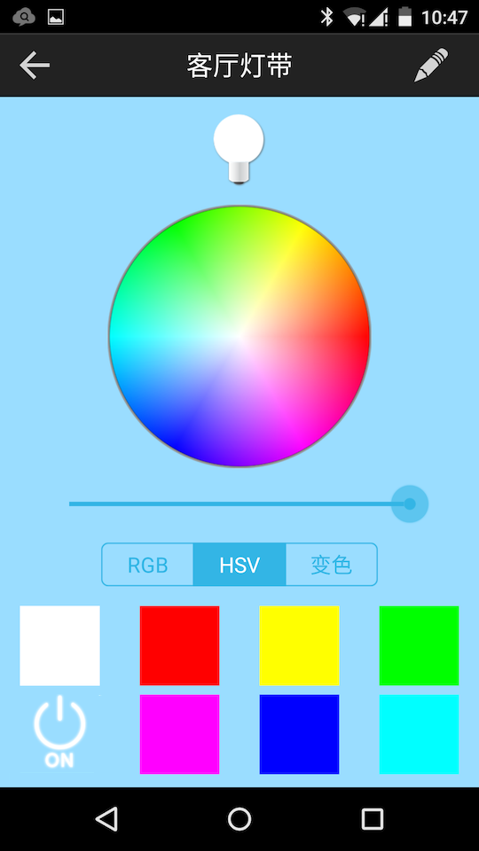

# 智能照明管理系统项目计划
郝建林  
2016-8-21
## 1. 概述

### 缘起
照明，是人类生产生活的基本需求。长期以来，从室内到室外，从私人空间到办公场所以至大型公共空间，人们在不断地追求更好的照明效果以及更低的能源消耗。到目前为止最重要的成果体现光源方面，特别是LED的大规模应用，然而对光源的控制仍与一百多年前没有太大区别，主流仍然是机械式的手动开关，辅以声、光传感器触发的自动开关。  
近年来，随着互联网的全面普及（包括移动互联网、IoT、云计算）以及人工智能的快速发展，我们看到照明控制有了新的可能，我们希望借助这些技术开发出更加便利和精准的控制方式并将其推向市场，所追求的目标仍然是照明效果的提升和能源消耗的降低。  

### 规划
1. 通过物联网技术，将照明系统连接到网络；
1. 设计移动应用，实现随时随地、按需开关及调光；
1. 借助云端服务，实现集中化的状态监控、定时，以及依据多种规则的自动控制；
1. 进一步地，基于实际运运行中收集到的数据，应用机器学习技术，挖掘照明与生产生活其他方面的内在联系，实现真正的智能照明。  

### 愿景
万物互联的时代正在到来，以照明为开端，我们可以将智能控制系统应用到安防、环境等各个领域，在为个体创造优质生活体验的同时提升社会整体效率，实现理想中的智慧城市，智慧地球。

## 2. 产品设计

### 产品形态
- 照明网关——将照明灯具接入互联网。目前在工程实践中，灯具与网关的连接已有较成熟的方案：传统上多采用有线连接——将若干照明回路连接到一个电源管理模块，模块之间采用RS485或其他总线连接，最终汇聚到交换机，以串行接口或以太网接口对接控制系统；而新建项目已开始在灯具中内置或外接运行Zigbee、蓝牙Mesh等协议的无线模块，实现无线组网。  
我们关注的重点是网关到云的连接，网关要能够适配多种不同的底层协议，转换为统一协议与云端通信。
- PC客户端——用于较大规模的系统，安装在监控中心的PC上，由管理人员对系统进行监控。
- 手机客户端——用于家庭，在酒店、写字楼等环境，由用户对自己所在区域的照明进行控制。
- Web页面——通过浏览器对照明系统进行监控（替代PC客户端），查看报表，管理登录用户等。

### 基本功能
- 灯具：每一盏灯具都可以单独查看状态和进行控制，包括开关、调亮度，调色温等。灯具可以被添加（由网关自动搜索）、删除、命名。
- 分组：一般根据物理区域将若干灯具可分为一组，进行整体控制。分组可以被创建、删除、修改、命名。分组可以重叠。
- 场景：可以将分组内部各灯具的状态保存为场景，如阅读、休息等，在需要时进行调用。每一个分组内可以创建多个场景。
- 定时：设置时刻表，在指定时间开关灯或调用场景模式。

### 使用场景
- 家庭：灯具数量少，有较强的个性化需求
- 办公场所：用户多，需要完善的权限管理
- 公共空间：灯具多，需要多级分组，以集中控制为主

## 3. 技术架构

### 网关
网关在软件上集成AWS IoT Device SDK，以MQTT协议与云端托管的IoT服务实现双向实时通信。网关上还要进行控制协议的转换（传统的命令和状态传递多采用各种格式的串行消息，需要对其解析，来自云端的命令也要转换成相应格式）。  

### 云

- 连接：
用AWS IoT实现设备鉴权和注册、ID分配，状态管理，消息传递。
- 数据库：
用AWS DynamoDB存储数据。用AWS IoT的规则引擎将所有消息保存到数据库中。
- 控制接口：
控制端用AWS IoT Device Shadows提供的HTTP REST API与设备交互。

### 控制端
- 浏览器：
用AWS Elastic Beanstalk服务托管Web页面，通过浏览器访问。
- 桌面：
基于Electron设计桌面端控制软件，以Snappy方式打包成Linux应用。
- APP：
基于Cordova设计Hybrid APP，实现跨平台运行。

## 4. 原型设计

### Web/桌面客户端
- 分组列表  
一个照明系统包含了若干分组，主页面列出所有的分组（可以根据实际情况分级），点击对应按钮即可查看分组的详情：  
  

- 分组成员和场景  
在分组详情页面，可以查看分组中各灯具的状态，点击按钮即可开、关灯具或调用场景：  
  

- 分组平面图  
为了使监控更加直观，可以为分组定义平面图，并将灯具图标放置在对应位置：  
  

### APP
- 灯具列表  

- 灯具控制  

- 创建场景  
如图，在针对家庭的APP中，为简化操作，可以不设置分组功能，但可以将当前各灯具的特定状态保存为场景：  

- 场景列表  
如图，在APP的场景列表中，可以一键调用场景：  

## 5. 黑客松开发目标
在AWS黑客马拉松上，根据本计划开发出产品原型，实现将实际的照明设备连接到AWS，并开发出网页版、桌面端及APP对单个灯具和分组进行控制。