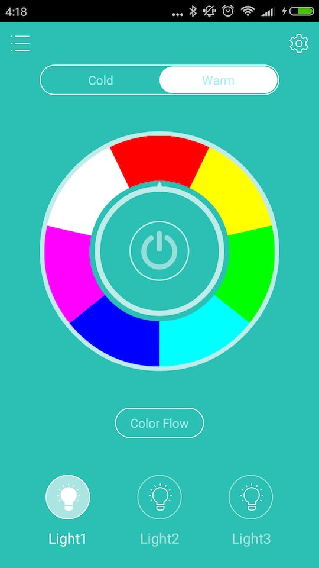

# 使用手机APP进行本地控制
## HTTP Restful API
为了在不连接云平台的情况下仍能在局域网中控制设备，网关上集成了HTTP服务，提供API接口供手机APP调用。  
HTTP API采用express框架：
```
var app = express();
var router = express.Router();

router.route('/lights')
    .get(function(req, res) {
        var devices = new Array();
        for(var light of host.lights) {
            var device = new Object();
            device.id = light.id;
            device.uid = light.uid;
            device.power = light.power
            devices.push(device);
        }
        res.status(200).json(devices);
      });

app.use('/api', router);
```
## Android APP
```
public class MainActivity extends Activity {
...
    @Override
    public void onLightPowerChanged(boolean isOn) {
        String curLights = curLights();
        if(curLights != null)
            Light.setLightPower(curLights, isOn ? Light.LIGHT_POWER_ON : Light.LIGHT_POWER_OFF, apiHandler);
    }
```
```
class Light {
...
    static String serverIp = "192.168.0.100";

    static String getUrl(String suffix) {
        return "http://" + serverIp + ":9000/api" + suffix;
    }

    public static void setLightPower(String lightId, int power, Handler handler) {
        String url = getUrl("/command/light/power");
        HttpRequestThread thread = new HttpRequestThread(url, handler, MSG_LIGHT_POWER);
        thread.addParam("id", lightId);
        thread.addParam("operation", (power == LIGHT_POWER_ON) ? "on" : "off");
        thread.start();
    }
```
