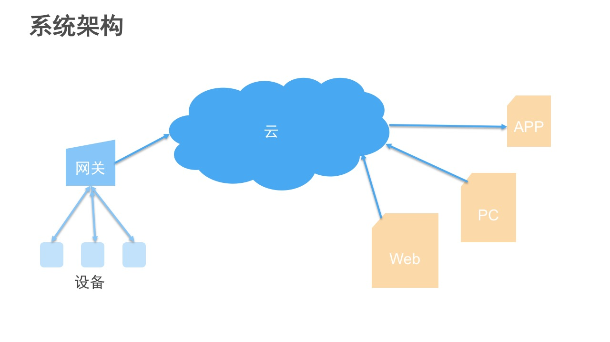

# 智能照明管理系统项目介绍
## 背景概述
深圳市酷图软件开发有限公司成立于2013年，专注设备智能控制与远程管理解决方案，面向照明、安防、家电等领域，为各类电子产品开发无线连网模块、手机APP及后台管理功能。  
基于过往的项目经验、客户需求和行业趋势，我们规划了一套智能照明管理系统，目标是将家庭、写字楼、酒店等各类区域的照明系统连接到云端，实现集中管理、自动控制，以达到提升照明效果、提高管理效率、降低能源消耗的目标。  
## 系统架构
  
- 首先我们需要一个网关，通过有线或无线方式与灯具连接起来，然后将网关连接到云平台。
- 我们在云平台上实现设备连接、消息传递，数据处理与存储。
- 我们针对不同的应用场景开发手机APP、PC客户端与Web页面，实现对系统的控制和管理。
  - PC客户端——用于较大规模的系统，安装在监控中心的PC上，由管理人员对系统进行监控。
  - 手机客户端——用于家庭；用于酒店、写字楼等环境，由用户对自己所在区域的照明进行控制。
  - Web页面——通过浏览器对照明系统进行监控（替代PC客户端），查看报表，管理登录用户等。

### 网关
网关硬件采用Dragonboard 410c开发板。此开发板集成了四核ARM® Cortex® A53处理器，单核频率可达1.2GHz，通信方面支持WiFi、蓝牙和GPS，并提供了多种扩展接口连接外设。这保障了网关可以应对规模较大的照明系统，并提供多样化的控制方式。  
网关软件采用专为物联网应用设计的Ubuntu Core操作系统。此系统最大的特点是采用Snappy包的方式管理应用，应用程序和其依赖的运行库打包在一起，便于快速布署和更新；此外，应用独立运行于各自的沙箱环境中，可以有效地实现数据隔离，保障系统的安全性。

### 云平台
云平台选择AWS。AWS的IoT服务采用MQTT协议实现与设备的安全连接和消息传递，并在此基础上提供了设备影子和规则引擎——设备影子用于保存和同步设备状态，规则引擎用于与文件存储、数据库、推送通知、Lambda函数等其他云服务的整合。这令我们可以专注照明的业务逻辑，实现快速开发。  

## 开发技术
系统各部分的程序代码统一采用JavaScript语言编写，JavaScript无需编译，同时拥有丰富的第三方库(npm)，可以有效提升开发效率。同时JavaScript的事件驱动特性非常适合于物联网应用。  
本项目开放源代码，代码托管于开源中国码云平台：[http://git.oschina.net/erabbit/OpenIoT](http://git.oschina.net/erabbit/OpenIoT)  

## 系统原型
目前我们已经完成了网关、云平台和Web页面上的基本功能，实现了远程控制和语音控制。以下是演示视频：[http://v.youku.com/v_show/id_XMTczODgwMTY0MA==.html](http://v.youku.com/v_show/id_XMTczODgwMTY0MA==.html)  

## 联系方式
如果您对此项目有兴趣，欢迎与我们交流：  

深圳市酷图软件开发有限公司  
郝建林  
Email：cooltools@qq.com  
ＱＱ：2335301794  
手机/微信：188 1855 5615  
地址：深圳市南山区科文路1号华富洋大厦四楼思微  